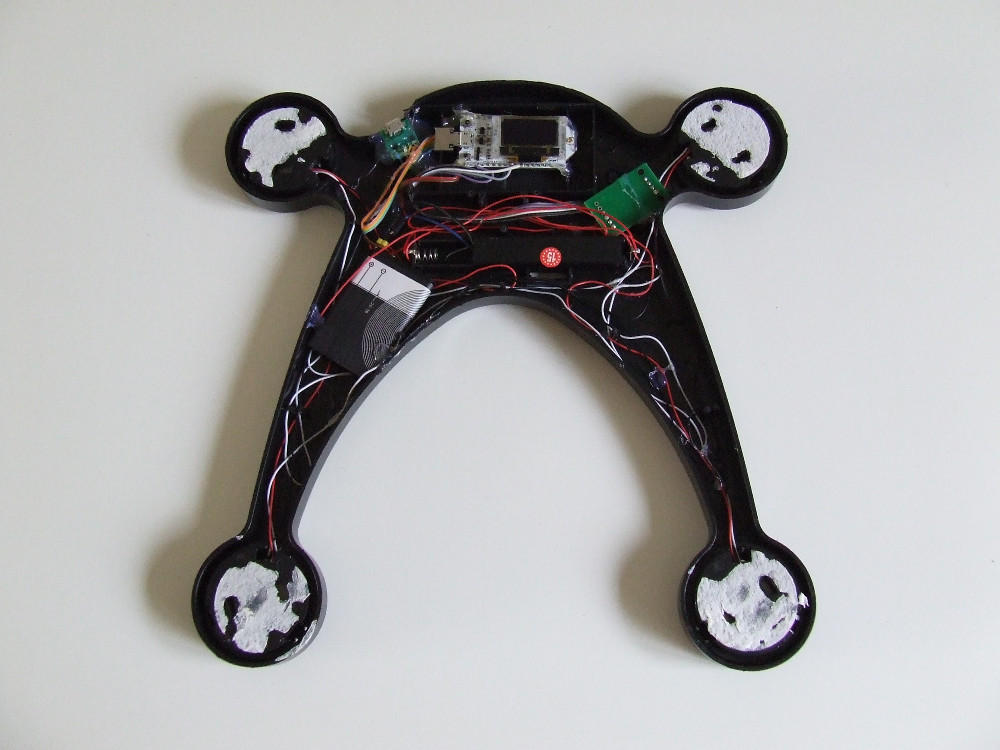
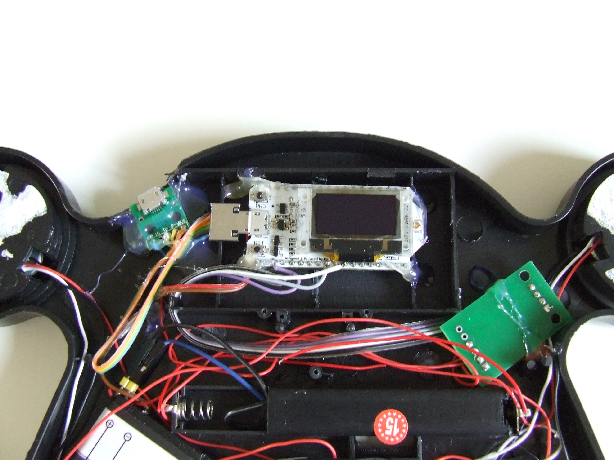
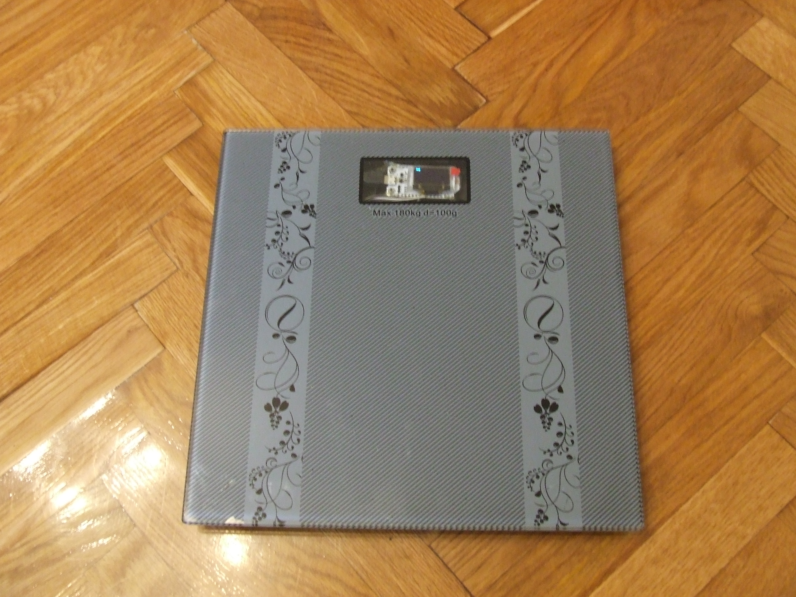
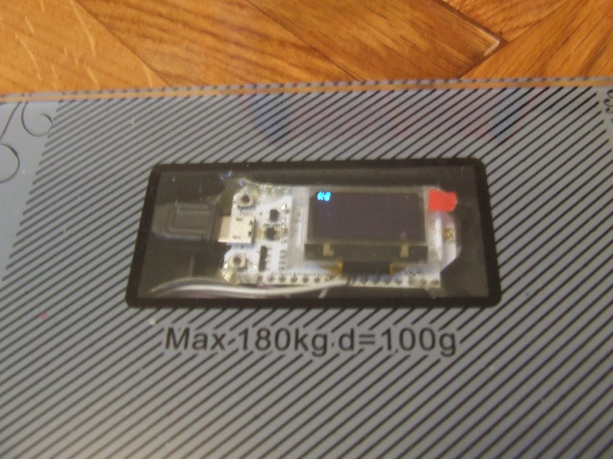

#Radiona.org global scale project

Project done for opensource medicine exibition
http://radiona.org/izlozba-medicina-otvorenog-koda/

hacked home scale sending weight to mqtt server

# Todo

    [x] Get data from Sensor
    [x] Scale must be updatable over air (OTA)
    [x] Create local web page that runs on ESP32
    [x] Test sending data over wifi
    [x] Send data to mqtt server
    [x] Parse data on nodered
    [x] Save data to csv
    [x] Make web page to display data
    [ ] Add BLE support
    [ ] Add Sending over LoRA
    [ ] Add user profiles over BLE
    [ ] Make it low power
    [ ] Make web page with user profiles
